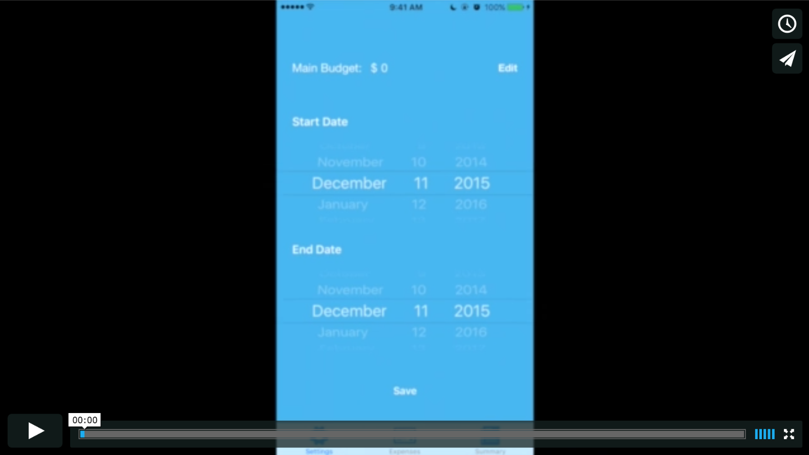

# BudgetAPP

An iOS application that tracks personal budget and expense. User has the ability to set up a personal budget for a desired date range. Each day user can track his/her expense amounts with additional details. A summary page containing budget and expense information along with various calculation results is available to user for making better financial decisions.

# Demo

Credit to Amy Joscelyn's blog on budgeting 
https://medium.com/@amyjoscelyn/moneymanagement-101-a-student-s-guide-to-austerity-budgeting-cb1d1d9b655e#.62634l1ne
